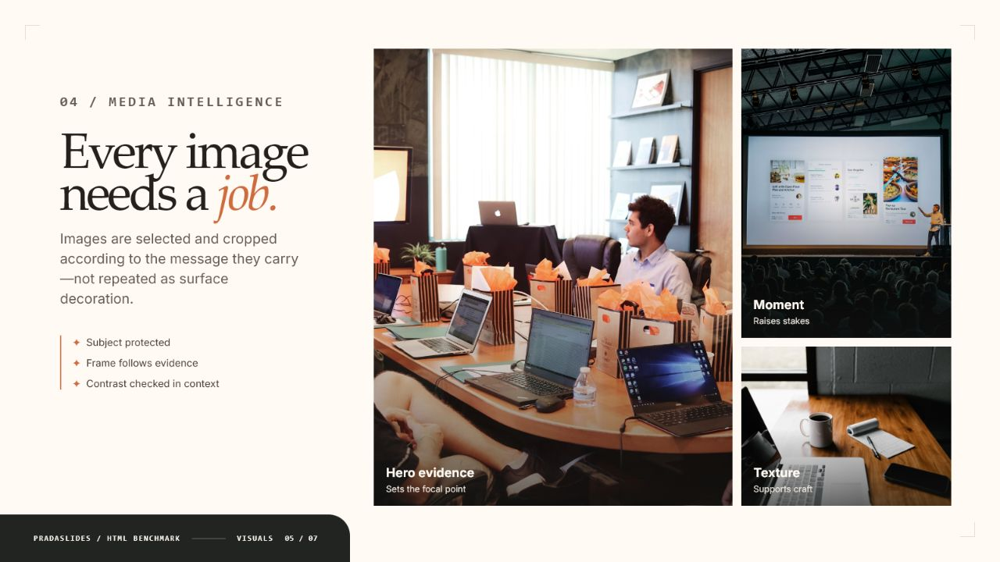
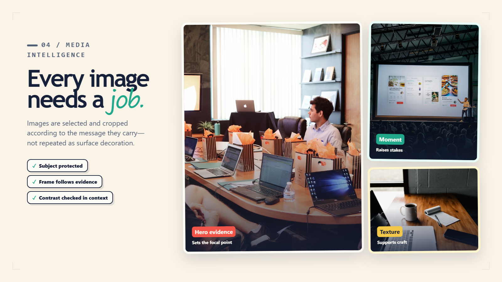
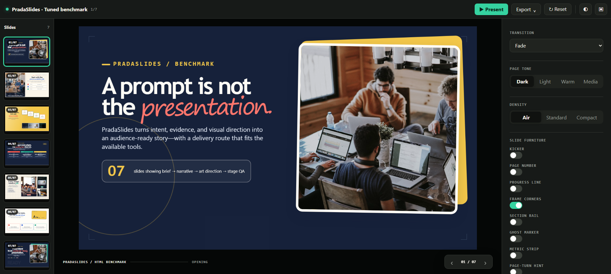

# PradaSlides

PradaSlides is an agent skill for creating audience-ready presentations from a short prompt or source material. It turns a request into a clear communication brief, evidence-aware narrative, product-specific visual direction, editable slide plan, and a verified delivery route—without forcing users to manage planning files.

When the user does not name a format, PradaSlides recommends:

- an editable `.pptx` as the source of truth; and
- a presentation-console `.html` preview rendered from that final PPTX.

PPTX only, native HTML slides, Word, PDF, or another requested format are supported routes. Brief, evidence, design-system, and visual-generation logic always run internally; their JSON/Markdown files are optional and generated only when requested or operationally necessary.

## Public HTML benchmark

The [tuned V2 HTML benchmark](examples/benchmark-html-tuned/) is a seven-slide, fictional showcase of the complete method: communication brief, narrative flow, capability-aware routing, deliberate media roles, stage-scale typography, and the interactive presenter console. It uses only external illustrative photography; no user-provided material is included.







To inspect the interactive console locally:

```bash
python -m http.server 8765 --bind 127.0.0.1
```

Then open `http://127.0.0.1:8765/examples/benchmark-html-tuned/`. The benchmark documents its image sources and usage notes in its [own README](examples/benchmark-html-tuned/README.md).

## What it covers

- portfolios, work/result reviews, proposals, sales and investor decks;
- strategy, research, technical, teaching, report, keynote, and template-system presentations;
- supplied photos, logos, screenshots, charts, and video with explicit media roles and crop decisions;
- capability-aware routing for text-only, vision, image-generation, video-generation, and delegated runtimes;
- visual QA for contrast, typography, frame selection, crop integrity, topology rhythm, and presenter-stage fit.

## Install

Clone the repository, then install it into an explicit agent skills directory:

```bash
python scripts/install_skill.py --target <agent-skills-directory>
```

For an existing installation, use `--replace`; the installer preserves a backup.

## Use

Ask the agent to use `$pradaslides`, then provide the presentation goal, audience, source material, preferred format, and any brand or visual references. If visual-generation permission or output format is unresolved, the skill asks one compact preference question and otherwise proceeds with sensible defaults.

To start a standalone project workspace:

```bash
python scripts/bootstrap_project.py --output <project-dir> --intent portfolio --contracts full
```

See [SKILL.md](SKILL.md) for the full workflow and [references/](references/) for the focused guidance.

## Validate

```bash
python scripts/self_test.py
python scripts/validate_design_system.py assets/starter/design-system.json
```

## Contributing

Keep changes focused on reusable agent behavior. Do not add user assets, credentials, source material without permission, or flattened slide exports as skill assets. Run the validation commands above before opening a pull request.

## License

Released under the [MIT License](LICENSE).
